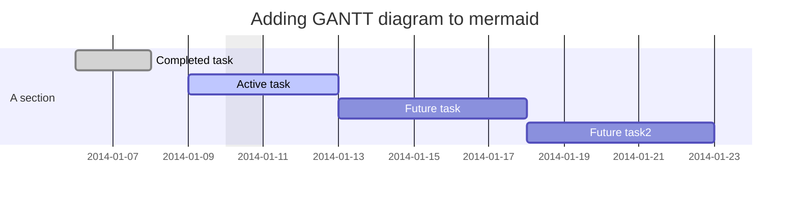

# Test repo for extensibility

This repo has a number of different extensions and various content elements that take advantage of that extensibility.

## Rendering
When using the extended-GitHub browser extension, users get enhanced rendering of full files or embedded chunks in markdown on GitHub 

### Full file

* Browsing to [this MP4 file](clearlynoticed.mp4) renders the MP4 in-place in GitHub

### Embedded math

Embedding math in your markdown is fun.  `${}^1/_2$` the time you might not even notice but simple things like `\(a^2 + b^2 = c^2\)` look way better. As you can see, equations can be embedded `$\sqrt[n]{1+x+x^2+x^3+\dots+x^n}$` directly in your normal text using `\(` or `$`. They can also be put in *display* mode using `\[` or `$$` delimiters as shown here.`$$\sum_{i=0}^n i^2 = \frac{(n^2+n)(2n+1)}{6}$$`

And if you'd like to really call it out, the math can be put centered in a `<pre>` block with a gray background much like the normal standalone code blocks.
```
\[ \sum_{i=0}^n i^2 = \frac{(n^2+n)(2n+1)}{6} \]
```

### Embedded mermaid


