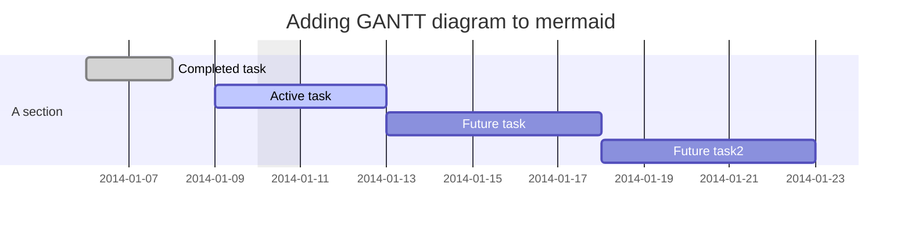

# Test repo for extensibility

This repo has a number of different extensions and various content elements that take advantage of that extensibility.

## Rendering
When using the extended-GitHub browser extension, users get enhanced rendering of full files or embedded chunks in markdown on GitHub 

### Full file

* Browsing to [this MP4 file](clearlynoticed.mp4) renders the MP4 in-place in GitHub

### Embedded math

The following is a math equation in LaTeX inline ```$\sum_{i=0}^n i^2 = \frac{(n^2+n)(2n+1)}{6}$``` and this next one is the same formula but in display (on it's own line) mode ```$$\sum_{i=0}^n i^2 = \frac{(n^2+n)(2n+1)}{6}$$```.

Could also use \\( \sum_{i=0}^n i^2 = \frac{(n^2+n)(2n+1)}{6} \\) for inline or \\[ \sum_{i=0}^n i^2 = \frac{(n^2+n)(2n+1)}{6} ]\\ for display math.


This next one is in MathML which is surprisingly more complicated.
<math>
  <mrow>
    <msup>
      <mi> a </mi>
      <mn>2</mn>
    </msup>
    <mo> + </mo>
    <msup>
      <mi> b </mi>
      <mn>2</mn>
    </msup>
    <mo> = </mo>
    <msup>
      <mi> c </mi>
      <mn>2</mn>
    </msup>
  </mrow>
</math>


### Embedded mermaid

