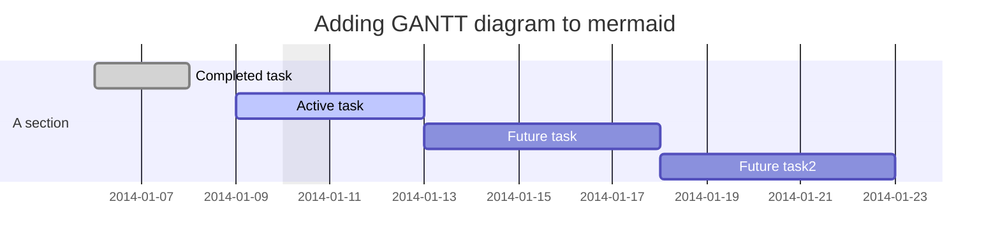

# Test repo for extensibility

This repo has a number of different extensions and various content elements that take advantage of that extensibility.

## Rendering
When using the extended-GitHub browser extension, users get enhanced rendering of full files or embedded chunks in markdown on GitHub 

### Full file

* Browsing to [this MP4 file](clearlynoticed.mp4) renders the MP4 in-place in GitHub

### Embedded mermaid

