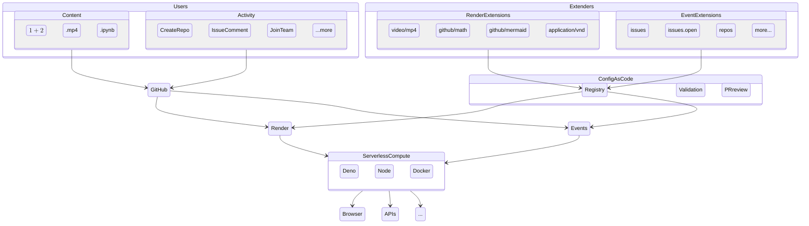

# Test repo for extensibility

This repo has a number of different extensions and various content elements that take advantage of that extensibility.

## Rendering
When using the extended-GitHub browser extension, users get enhanced rendering of full files or embedded chunks in markdown on GitHub 

### Full file

* **Jupyter notebooks** -- Check out [this Juptyer notebook file](Lorenz.ipynb). Note it's also executed!
* **MP4** -- Bored? Watch [this MP4 file](clearlynoticed.mp4)
* **Excel** -- Curious? Checkout [this XLSX file](olympics.xlsx) for Olympic medal standings

### Embedded content

* [**Math**](math.md) -- Embed complex TeX/LaTeX, MathML, or ASCIImath like this (`$\sqrt[n]{1+x+x^2+x^3+\dots+x^n}$`) directly inline in your text or as stand-alone code blocks
* [**Charts**](charts.md) -- Embed Gantt charts, sequence or class diagrams, and more as stand-alone code blocks. You can even show Git graphs like the on below. [Community demand](https://github.com/github/markup/issues/533).

## How does it work?

